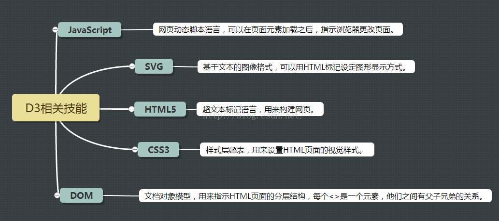

# D3.js入门(乞丐版)

#### 仅供参考，以[原英文版](https://github.com/d3/d3/blob/master/API.md)为准

## D3.js(Data-Driven Documents)简介
>D3.js是一个可以基于数据来操作文档的JavaScript库。可以帮助你使用HTML,CSS,SVG以及Canvas来展示数据。D3遵循现有的Web标准，可以不需要其他任何框架独立运行在现代浏览器中，它结合强大的可视化组件来驱动DOM操作。
---
## 需要哪些必备技能？
---

>这里主要介绍一下SVG 和 D3的核心库

### SVG(可缩放矢量图形)
SVG: `<path>`元素是SVG基本形状中最强大的一个，它不仅能创建其他基本形状，还能创建更多其他形状! [**MDN关于path的介绍** ](https://developer.mozilla.org/zh-CN/docs/Web/SVG/Tutorial/Paths)

### D3核心概念 
  - [SVG形状](https://github.com/d3/d3/wiki/SVG-%E5%BD%A2%E7%8A%B6)
  - [布局](https://github.com/d3/d3/wiki/%E5%B8%83%E5%B1%80)
  - [比例尺](https://github.com/d3/d3/wiki/%E6%AF%94%E4%BE%8B%E5%B0%BA)
  - [过渡](https://github.com/d3/d3/wiki/%E8%BF%87%E6%B8%A1)

### 一些好用的工具链接 
 > V3中文翻译比较全面，V4还没有完全翻译。
##### D3.js中文API
  - 版本号：[V3.5.17](https://github.com/d3/d3/wiki/API--%E4%B8%AD%E6%96%87%E6%89%8B%E5%86%8C)
  - 版本号：[V4.x](https://github.com/tianxuzhang/d3.v4-API-Translation)
##### D3.js英文API
  - 版本号：[V3.5.17](https://github.com/d3/d3-3.x-api-reference/blob/master/API-Reference.md)
----
- [检索不同版本的案例](http://blockbuilder.org/search#d3version=v4)

##### 一些可能用到的布局

[直方图布局](https://bl.ocks.org/mbostock/3048450)

[包布局](https://github.com/d3/d3/wiki/%E5%8C%85%E5%B8%83%E5%B1%80)

[分区布局](https://github.com/d3/d3/wiki/%E5%88%86%E5%8C%BA%E5%B8%83%E5%B1%80)

[饼布局](https://github.com/d3/d3/wiki/%E9%A5%BC%E5%B8%83%E5%B1%80)

